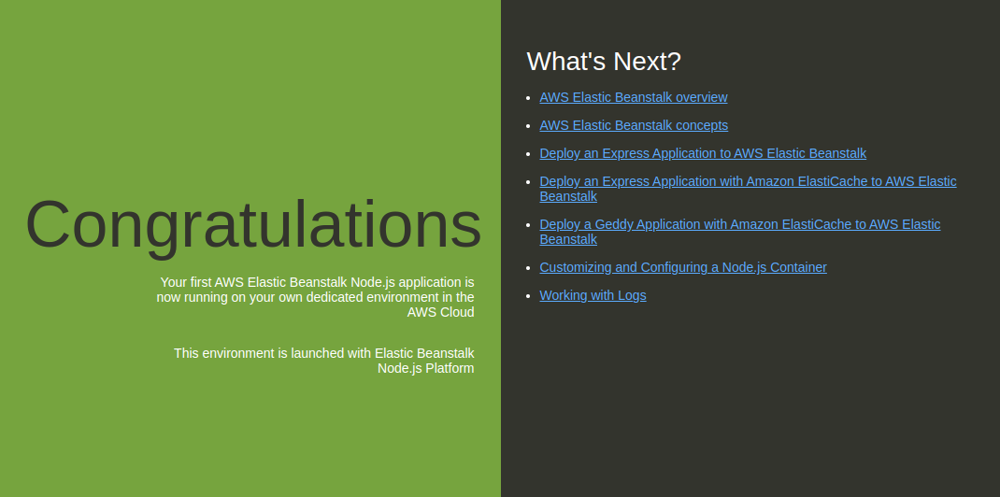

# Elastic Beanstalk - Terraform
## Estructura
### Archivos
| Archivo | Descripción |
|---|---|
| [data.tf](data.tf) | Consultas al proveedor AWS |
| [main.tf](data.tf) | Estructura principal con los recursos |
| [outputs.tf](data.tf) | Valores entregados al final de la implementación |
| [tf.tfvars](data.tf) | Valores para las variables |
| [variables.tf](data.tf) | Declaración de variables |
| [versions.tf](data.tf) | Versiones necesarias |
### Variables
| Variable | Descripción |
|---|---|
| bice_vpc_id | El ID de la VPC |
| bice_name_application | Nombre del beanstalk application |
| bice_environment | Nombre del environment de beanstalk |
| bice_solution_stack_name | El [stack](https://docs.aws.amazon.com/elasticbeanstalk/latest/dg/concepts.platforms.html) para el envirioment |


## Prerequisitos
Las versiones necesarias se encuentran en el archivo de [versiones](versions.tf).

### Cuenta configurada en AWS
Se debe tener un usuario asignado a un grupo con estos permisos como máximo:
* AmazonEC2FullAccess
* IAMFullAccess
* AmazonS3FullAccess
* AmazonVPCFullAccess
* AdministratorAccess-AWSElasticBeanstalk

### Credenciales
El usuario debe tener configurada sus claves de acceso, las cuales se deben establecer como variables de ambiente. Para esto, exportar las variables necesarias.
```
export AWS_ACCESS_KEY_ID="tuAccessKeyId"
export AWS_SECRET_ACCESS_KEY="tuSecretAccesKey"
export AWS_REGION="tuRegion" #Ejemplo: "us-east-1"
```

## Implementación
Para implementar el módulo, usar los comandos de terraform.
```
terraform init
terraform plan
terraform appy
```
Para no ingresar las variables manualmente se debe modificar y utilizar la  [plantilla](tf.tfvars) y luego añadir __-var-file=tf.tfvars__ al comando. 

También se puede evitar la confirmación del comando añadiendo __--auto-approve__.

Ejemplo:

```
terraform apply -var-file=tf.tfvars --auto-approve
```

